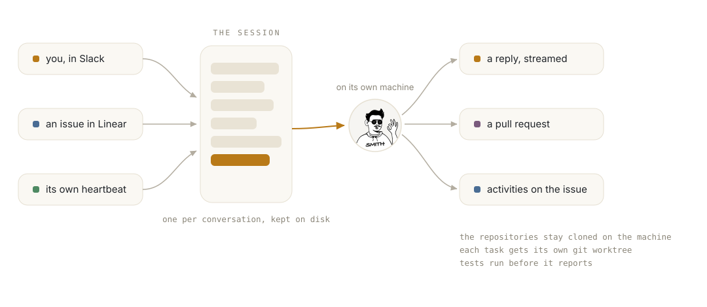

<p align="center">
  
</p>

<p align="center"><strong>Smith</strong>, an engineering agent with a machine of its own.</p>

<p align="center">
  <a href="docs/setup.md">set it up</a> ·
  <a href="AGENTS.md">how the repo works</a> ·
  <a href="agent/CLAUDE.md">the agent's manual</a>
</p>

<p align="center">
  <a href="https://github.com/mcheemaa/smith/actions/workflows/ci.yml"></a>
  
  
</p>

You talk to Smith in Slack. You hand it issues in Linear. It works on a Linux box you
can SSH into, with your repositories cloned, and it ships pull requests on GitHub. It runs on the Claude Agent SDK and signs in the way Claude Code does, with
your own Claude subscription. There is no UI to run and nothing to host but one
process.

Underneath is a Claude Code session per conversation, kept on disk. Reply in the
thread a week later and it remembers. Every few hours a heartbeat wakes it to walk
its open pull requests and its queue. What it knows about how to work is one
markdown file it is allowed to edit.

<p align="center">
  <picture>
    <source media="(prefers-color-scheme: dark)" srcset="brand/smith-harness-dark.svg">
    
  </picture>
</p>

## How it works

The session is the unit. A Slack thread is a session, a direct message is one long
session, a Linear agent session is a session, and the heartbeat has one of its own.
Three things write into them: people, Linear, and the heartbeat timer. Runs on
one session are serialized; a few sessions run at once. Sessions are Claude Code
transcripts on the machine's disk, so a restart, a deploy, or a week of silence
loses nothing, and a run cut off by a restart resumes on the next boot.

Replies arrive where the request came from. In Slack the reply streams into the thread as a
task timeline followed by the answer, with reactions on your message for received
and done. In Linear it shows up as activities on the issue's agent session, with
the pull request linked when there is one.

## What it does

| Slack | Linear |
| --- | --- |
| direct messages and `@Smith` mentions, over Socket Mode, no public URL needed | assign or mention the agent and Linear sends the session; it answers within seconds |
| a mention inside an existing thread reads the thread first | follow-ups in the same session resume the same conversation |
| attached files are saved into the workspace for the agent to open | the pull request it opens is attached to the session |
| it is the bot user: any Slack Web API method, and file uploads, as itself | the Linear MCP server, as the agent's own Linear identity |
| only the people you list can talk to it | `stop` in Linear aborts the run |

## The harness underneath

The TypeScript is plumbing, about a thousand lines: route a message to a session,
stream the run back, remember which thread is which session, write every run down.
How the agent works is `agent/CLAUDE.md` and `agent/heartbeat.md`, copied onto the
machine on first start and yours to edit after that. The agent runs with full
permissions on its own machine.

## Run it

You need a machine with Bun, git, gh, and Claude Code, signed in to GitHub and to
your Claude account, and a Slack app made from `deploy/slack-manifest.yaml`.
[docs/setup.md](docs/setup.md) covers every step.

```console
bun install
cp .env.example .env.local        # fill in
bun start
```

Open Smith under Apps in Slack and say hello. The checks are
`bun run typecheck && bun run lint && bun test`.

## Deploying

Any Linux box you can SSH into. `deploy/install.sh` prepares a fresh Ubuntu machine
and installs a systemd unit; `just deploy user@host` syncs a checkout and restarts.
Sign in to Claude and GitHub on the box as the `smith` user, or put a long-lived
token from `claude setup-token` in `.env.local`. Linear tokens are minted by Smith itself
from the application's client credentials.

## Working in the repo

[AGENTS.md](AGENTS.md) is the working constitution. [CONTRIBUTING.md](CONTRIBUTING.md)
has the short version, and security reports go through [SECURITY.md](SECURITY.md).

## License

MIT. See [LICENSE](LICENSE). The avatar is composed from the
[Notionists](https://heyzoish.gumroad.com/l/notionists) set by Zoish (CC0 1.0)
through [DiceBear](https://www.dicebear.com).
